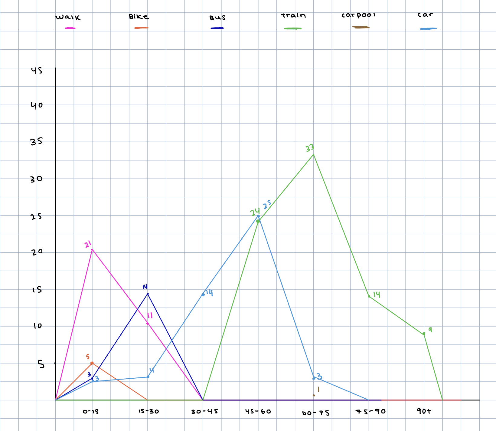
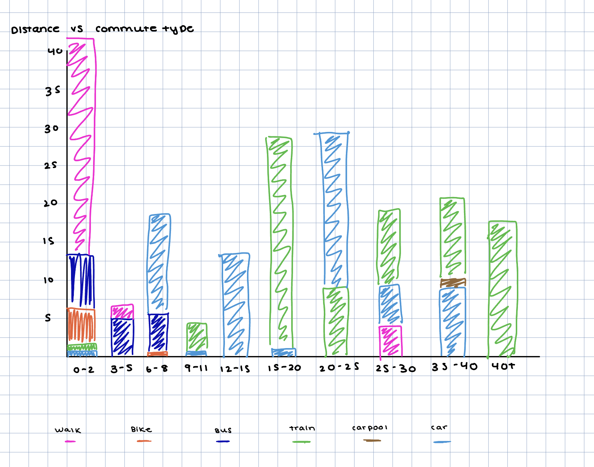
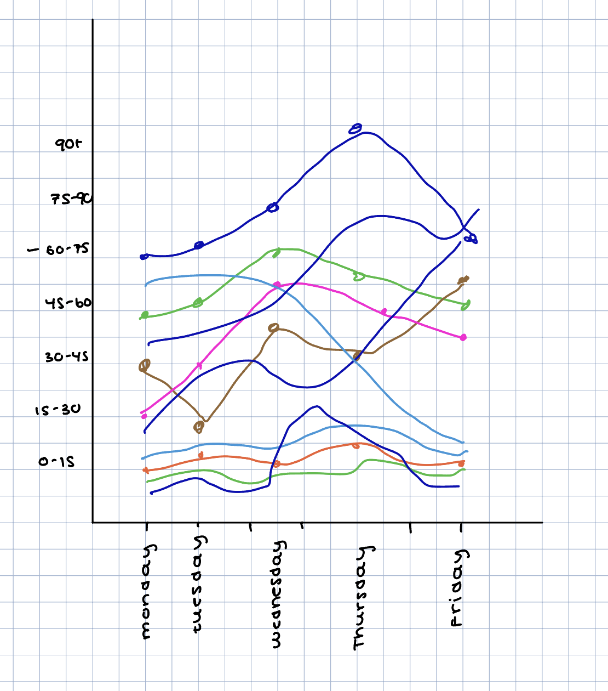

# **Task 1 Observation and Data Collection Plan**

For our assignment, we wanted to observe different variables that could impact commute times to UIC. We wanted to observe this because UIC is a big commuter school with students coming from all different types of neighborhoods. We have people coming from close by in Little Italy and Pilsen, and then people coming from further neighborhoods like Algonquin and Gurnee. We find this interesting because there could be a variety of factors that could influence how someone’s commute can go. The distance can decide the mode of transportation, the weather can decide the traffic, the day can influence if they even commute to campus or not. Four initial domain questions that we propose that would help us investigate and guide data collection are:

- What is the biggest indicator that there will be longer commute times in someone’s day?
- Does neighborhood/distance predict transportation mode choice?
- Does weather affect transportation modes unequally?
- Is there a “worse day to commute”?

### Proposed Data Collection Process:

**What constitutes one observation?** One observation will be constituted by the commute of a single individual on one day of the week.
What attributes will you record for each observation? Attributes that will be recorded for each observation will be mode of transportation, arrival time, mileage, length of commute, weather at time of observation and city they are commuting from.

**Where and when will you collect the data?** We collected data via an anonymous google form over the course of multiple days.

**Over how many locations, times, or days will you collect it?** Data is collected from various locations, as students commute from different locations. Students also arrive at different times to school due to their schedule, we decided on hour intervals from 7am to 2pm. Collection days are Monday through Friday during the week of 9/14-9/18.

**How will you ensure that your data captures meaningful variation rather than a single snapshot?** Our data will capture meaningful variation because of the different attributes being taken into account. When people are coming in at different times and from different locations, the weather isn’t the same. Especially in Chicago, it can be raining one second, and sunny the next. That mixed in with the variability of user location results in very different observations.

**How will you decide what to observe?** We decided on what to observe based on factors that we take in when commuting to school. We also decided based on variables that are known for typically causing delays to see what differences in commute times it causes based on neighborhood and mileage.

**How will the collection be divided among group members?** Everyone in the group will be responsible for sharing the google form with people they know, organizations they are a part of, courses they are in via piazza, etc. Everyone in the group will be responsible for ensuring that we are collecting meaningful data.

**What might your collection process fail to capture?** Our collection process may fail to capture what the cause of the delay could be if there are multiple variables changing. It also may fail to capture reasoning with people commuting shorter distances, as delays don’t tend to be as drastic in those cases.

**How might your collection process introduce bias?** Our collection process may introduce bias through distribution bias, sharing only with people in our network could result in oversampling students with similar variables. It also could result in self reporting bais where people are guessing their time rather than measuring it.

### Initial Data Table:

| Attribute         | Type         | Description                                                                           | Example                                                           |
| ----------------- | ------------ | ------------------------------------------------------------------------------------- | ----------------------------------------------------------------- |
| respondent_id     | categorical  | an anonymous identifier to determine which days of the week belong to which responder | R1 R2 R3                                                          |
| day_of_week       | categorical  | which day of the week does their response correlate to                                | monday, tuesday, wednesday, thursday, friday                      |
| transportation    | categorical  | what mode of transportation did they use for their entry                              | car, carpool, train, etc                                          |
| arrival_window    | quantitative | what time they arrived to campus that day                                             | 8am, 9am, 10am, 11am, etc                                         |
| mile_distance     | quantitative | range of how many miles they are commuting                                            | 1-2, 2-3, etc                                                     |
| commute_time      | quantitative | range of how much time it took them to get to campus in minutes                       | 0-15, 15-30, 30-45, 45-60                                         |
| weather           | categorical  | what the weather was at the time of their commute                                     | sunny, cloudy, raining, snowing, etc.                             |
| city/neighborhood | categorical  | what area of illinois is the respondent commuting from                                | little italy, pilsen, belmont cragin, schaumburg, naperville, etc |

# **Task 2: Pilot and Data Collection**

Before collecting the complete dataset, we conducted a small pilot with approximately 10 observations to test the structure of our Google Form, our variable definitions, and whether the instructions were clear. We distributed the initial form to a few classmates and reviewed the responses together as a group.

### Attribute Clarity and Ease of Recording

Yes. Respondents were able to select their commute time, weather condition, duration, and mode of transportation without confusion. The grid format we used in our Google Form made it easy for respondents to report an entire week of commutes in one submission, rather than filling out the form five separate times.

### Handling Ambiguous Observations

The main difficulty was handling days when respondents do not commute to campus. It was unclear whether they should leave the row blank, select "N/A," or skip it entirely. We added an "N/A" option to every question for each day, which resolved most of the confusion. However, we noticed that some respondents still selected a mode of transportation (like "Other") on days they marked "N/A" for time and duration. This told us that respondents do not always interpret "N/A" consistently across all questions, and we flagged it as a data cleaning issue to address later.

### Consistency Across Group Members

The attributes and categories were straightforward, and both group members interpreted them the same way. We agreed on definitions before distributing the form to avoid inconsistency.

### Missing Attributes

During the pilot, we realized we had not asked respondents where they were commuting from. Without a location attribute, we could not do any spatial analysis or compare suburbs versus city commuters. We added a location question after the pilot, asking respondents for their starting city or neighborhood. Because the earliest pilot responses did not include location, those rows have missing location data. We documented this as a known limitation of the dataset.

### Unnecessary Attributes

Every attribute we collected maps to at least one domain question we want to investigate. We considered dropping the weather question at one point because it added complexity to the form, but we kept it because it enables comparisons between conditions (rain vs. sun) that are central to our project.

### Impact on Domain Questions

The pilot revealed two important limitations that changed how we approached our domain questions:

**Missing location data.** We originally planned to analyze commute patterns geographically, but without a location attribute, we could only compare distance buckets, not actual starting areas. After adding the location question, we can now ask questions like "do students from farther suburbs rely more on cars than trains?"

**Bucketed instead of numeric values.** We collected distance and duration as ranges (e.g., 15–30 minutes, 6–8 miles) rather than exact numbers. This means we cannot calculate precise averages or make true scatter plots. We can still compare groups and identify patterns, but our analysis is limited to ordinal comparisons rather than continuous correlations. We documented this as a tradeoff: bucketed data is easier for respondents to report quickly and accurately, but it limits the types of visualizations we can create.

### Revisions Made After the Pilot

Based on what we learned, we made the following changes before the full collection:

- Added a question asking respondents for their starting location (city or neighborhood)
- Clarified instructions for the N/A option so respondents understood it applies across all questions for that day
- Accepted that bucketed distance and duration would limit us to ordinal comparisons and planned our domain questions accordingly

### Full Data Collection

After revising the form, we distributed it through club Discord servers and to classmates. The form remained open for two weeks, so we can have two weeks of data to compare variables like weather. Each respondent reported their commute for all five weekdays in a single submission.

We collected 51 responses, giving us approximately 230 total observations (51 respondents × 5 days) before removing N/A entries.

The data was collected anonymously. No names, faces, license plates, or other personally identifiable information were recorded.

### Dataset and Data Dictionary

The final dataset is stored in the repository as `commute_data.csv` in long format, with one row per respondent per day.

### Data Dictionary

| Attribute | Type | Description | Example |
|---|---|---|---|
| respondent_id | Categorical | Unique identifier for each respondent (from form timestamp) | R001 |
| day_of_week | Categorical | Day of the week | Monday |
| time | Categorical | Hour of commute | 11am |
| weather | Categorical | Weather condition during commute | Cloudy |
| commute_time | Ordinal | Commute duration in bucketed ranges | 45-60 Minutes |
| transportation_mode | Categorical | Primary mode of transportation | Car |
| mile_distance | Ordinal | Distance from starting point in bucketed ranges | 25-30 Miles |
| location | Categorical | Starting city or neighborhood | Pilsen, Chicago |

# **Task 3: Data Description and Domain Questions**
So far, we have 52 people who responded to our Google Form. Each person answered questions about every day of the week, so we should have around 260 rows in total (so one row is one person for one specific day). We took into account people who don’t commute on certain days, so our final number of rows will be less after removing those days for certain people. Our attributes are respondent_id, day_of_week, transportation, arrival_window, mile_distance, commute_time, weather, city/neighborhood. The data was collected by making a Google Form that we sent out to students at UIC. The students were people we know, and we also asked them to send it to anyone they know. We had different questions such as: which days this person commutes to campus, how the weather conditions were on each day, how long the commute was in minutes, the primary mode of transportation, the distance from the starting point, and the name of the current neighborhood. In terms of variations, we noticed the change of weather for different days, which also potentially changes the commute time on specific days. There were things that were difficult to record, such as if the weather changes throughout the day while the person was commuting or if a person was using multiple forms of transportation, since they could only pick one of them. Potential biases might come from the fact that the form was completed by people known to us, who are mostly people in Engineering and specifically CS majors, so it is possible that our arrival at UIC might be similar because of our schedules. There was some information that’s potentially lost based on the way we created a Google Form, for example, we don’t know the exact time someone arrived on campus (if they arrived at 8:15 or 8:45) since we gave rough estimates at 7 am, 8 am, 9 am, etc. Additionally, it might be possible that some people don’t remember exactly whether it was cloudy or rainy on a specific day, and therefore the weather data might be inconsistent. Our Google response sheet was storing the data in the tables where each person is one row, and all the information for that person is stored in a column. We decided to make our dataset in the long format, which is easier to read, and each row will represent one person and their responses for one specific day. Our domain questions are: 

1)What is the biggest indicator that there will be longer commute times in someone’s day? 
This question is a great connection to our data and attributes like mile_distance, transportation, day_of_week, and commute_time. It helps us go in a few different directions depending on what we want to focus on, but we can also combine everything to create one detailed visualization.

2) Does neighborhood/distance predict transportation mode choice? 
This connects to our attributes mile_distance, city/neighborhood, and transportation. From our data, we can see specific patterns of transportation and when people are most likely to use a specific transportation mode
3)Does weather affect transportation modes for people who walk or bike to UIC?

We changed this question from task 1(Does weather affect transportation modes unequally?) to make it more specific. After looking at the data, we concluded that it won’t be useful to look at people who travel by car or train on the days when it’s raining, since those probably won’t change. It connects to our attributes: transportation, respondent_id, weather, and day_of_week.

4)Is there a day when the commute takes longer compared to the rest of the week?
We also revised this question a little bit from task 1(Is there a “worse day to commute”?). The question from task 1 was pretty broad and unclear, and we wanted to explain what “worse” means. It connects to our attributes:commute_time, arrival window, and day_of_week.

# **Task 4: Task Abstractions**

1. **What is the biggest indicator that there will be a longer commute time in someone’s day?**
   - **Action:** Discover (dependency) and Compare (distributions) because we need to work through both steps, we need to see if there is a dependency occurring in commute times, as well as comparing across multiple observations
   - **Target:** Is there a dependency between commute_time and other attributes we are collecting.
   - **Abstract Task:** Compare the distribution of commute_time across different categories of distance, mode, and day in order to discover which attribute has the strongest relationship with longer commutes
   - **Reasoning:** The domain question asks for a single attribute that has the largest effect on someone’s commute length. We have ordinal data that doesn’t have any notable dependent variables yet. So the real task here is to compare and then make an assumption as to what the dependency is.
2. **Does neighborhood/distance predict transportation mode choice?**
   - **Action:** Compare (distributions) and Discover (correlations)
   - **Target:** Correlation and dependency between transportation and mile_distance/neighborhood.
   - **Abstract Task:** Compare the distribution of transportation modes across distance or neighborhoods to discover whether a certain mode of transportation cluster together at certain points. - **Reasoning:** The goal here is to compare transportation mode frequency within each distance/neighborhood to visually discover a pattern.
3. **Does weather affect transportation modes for people who walk or bike to UIC?**
   - **Action:** Compare(distributions) and Identify (subset behavior)
   - **Target:** The distribution of walkers and bikers across different weather conditions
   - **Abstract Task:** Identify the subset of respondents who walk or bike occasionally and compare how often they commute under each weather condition to discover if the weather affects their mode of transportation.
   - **Reasoning:** This question is to specifically see how weather affects people who typically walk or bike. Abstraction of this task requires us to identify the subset, and from there see any notable differences within the subset based on the weather for the day.
4. **Is there a day when the commute takes longer compared to the rest of the week?**

- **Action:** Discover(trend) and Compare(distributions)
- **Target:** Trends across ordered categorical attributes like day_of_week in order to compare commute_time across different days
- **Abstract Task:** Compare the distribution of commute_time across each day of the week to discover whether any single day stands out as an extreme.
- **Reasoning:** Since our days of the week are consistent, as well as how often someone commutes to school due to set schedules, we are able to compare across the days and see how someone’s commute can differ across each day.

**Reflection**
We mapped these domain questions the way we did because it revealed that what we are trying to solve is through comparison and distribution. All of them reduce to the same action applied to different attribute pairs. But the same action can reveal different things about our data that we wouldn’t have thought about before. Our data is mainly categorical and ordinal, which reshapes the task that we need to complete. This is useful to know going into Task 5. When working with more comparisons and distribution actions, this means we should lean more towards comparison friendly designs like side by side bars and heat maps. Rather than designs that are built for correlation which our bucketed data would have difficulty supporting.

# **Task 5: Visualization Sketches**

#### **Sketch #1: Days Where Most People Commute**

The motivation behind this sketch was to create a simple, baseline visualization of how many respondents commute to campus on each day of the week. This addresses the domain question of which days see the highest and lowest campus attendance. The attributes represented are day of the week (categorical) and number of respondents (quantitative). The main visual channel is bar length/height mapped to count, with color used redundantly to distinguish each day rather than to encode additional information.
This design worked well in the way that it is immediately readable. What did not work as well is that a bar chart can only show one attribute (count) against one categorical axis (day), so it cannot reveal anything about why attendance drops on Friday or how it relates to other variables like weather or time. Nothing about the sketch felt confusing, but the question itself is limited in scope, so this is more of a starting or reference visualization than a deep analytical one. It differs from our other sketches in that it is the most conventional chart type we used, relying on a single, well-known channel (length) rather than experimenting with less standard encodings like color intensity or curve shape.

#### **Sketch #2: Commute Arrival Time and Weather Conditions**

The motivation behind this sketch was to visualize what time people generally leave home depending on the weather condition that day, to explore whether bad weather (rain) causes people to leave earlier than on cloudy or sunny days. This addresses the question of whether weather conditions shift commute timing. The attributes represented are weather condition (categorical: sunny, cloudy, raining), departure time (temporal), and number of respondents (quantitative). The marks are points connected by lines, one line per weather condition, with color as the main channel distinguishing each condition and position along the x-axis and y-axis encoding time and count.

This worked well for showing the overall shape of each weather condition's departure pattern and made it easy to compare peak times across conditions. What did not work as well is that with only three overlapping lines, it is still a bit visually busy at the crossover points (like 10am to 11am), and line charts like this assume a level of precision in the data that we do not really have, since our time data was collected in discrete hourly buckets rather than continuous values. One alternative we discussed but did not sketch was a box plot, with one box per weather condition summarizing the distribution of departure times (median, spread, and range) along a shared time axis. This would have traded some of the shape and pattern detail of the line chart for a much clearer, more direct answer to "do people leave earlier when it rains," since it would show at a glance whether the median departure time for rainy days sits earlier than for cloudy or sunny days. It differs from our other sketches because it is the only one focused specifically on the relationship between weather and time, rather than weather and duration, or day and attendance

#### **Sketch #3: Weather Conditions vs Commute Duration **

The motivation behind this sketch was to create a visualization that uses shades of a single color as a channel to communicate density, and to find a way to combine categorical (weather) and quantitative/temporal (commute duration in minutes) data in the same view. This addresses the question of whether weather conditions impact how long people's commutes take, and how many people fall into each weather/duration combination. The attributes represented are weather condition, commute duration (in bucketed time ranges), and count of respondents. The marks are grid cells, with color saturation as the main visual channel encoding count. Darker cells indicate more respondents in that weather/duration combination.
This worked well because it let us represent three variables at once (two categorical or ordinal axes plus one quantitative value) in a compact grid, and it made a clear pattern jump out immediately: rainy commutes cluster heavily at 60 to 75 minutes, noticeably longer than cloudy or sunny commutes. What did not work as well, or felt limited, is that the shading in the hand-drawn version was eyeballed rather than tied to an actual color scale, so it is hard to judge exact values just from color alone without reading the numbers in each cell. A proper legend would fix this. It differs from our other sketches because it is the only one relying on color intensity rather than position or length as the primary channel, and it is the only one that layers three attributes into a single compact view instead of comparing along one or two axes.

#### **Sketch #4: Different Transportation Types vs Commute Times**

The motivation behind the sketch was to display how different commute types could vary in time, but also see if there was a way we could identify a trend by commute type. At a school like UIC are people who are using a specific mode of transportation experiencing very similar commute lengths? The attributes being represented are commute_time and transportation. Marks and visual channels that are being utilized include a line graph, where each line represents a different mode of transportation. The x axis represents the time blocks of commute lengths, and y represents the amount of people that had a commute length falling in that range. What worked well here was being able to see a visual representation of the maximum and minimum of each mode of transportation, as well as which mode of transportation is not used as often. What didn’t work so well was that using time frames instead of exact time resulted in people getting grouped up that may not have taken the same amount of time. 15 minute blocks could have major variance in between. Which resulted in confusion when trying to graph, originally I wanted to make this a scatterplot graph where each dot color represented a respondent, but that made it difficult. This sketch differs from other sketches because it allows for people to visually see the differences in transportation type.

#### **Sketch #5: Distance of Travel vs Transportation Type**

The motivation behind this graph was to figure out a way to display how we can show if there is a correlation between mode of transportation vs the distance in miles someone travels. We wanted to be able to answer the question of: Is there a preferred mode of transportation depending on mileage. Attributes being represented are transportation and mile_distance. In order to display this, I used a stacked bar graph, that way not only were we getting an aggregated value for each type, but were able to see the makeup of different modes of transportation. This worked well because the different colors allowed for you to see what mode of transportation it represented, and how many people of that color relied on that mode of transportation depending on mileage. What didn’t work well was similar to the last graph, grouping up the mileages resulted in skewed graphs in some areas. Not allowing you to be curious and try more unique plotting methods that relied on respondent_id. This graph differs from other sketches because it allows you to see any outliers based on color, as well as answering different questions such as how many people commute from a specific distance away, how many people commute by train and live 35-40 miles away, etc.

#### **Sketch #6: Length of Commute vs Day of the Week**

The motivation behind this sketch was being able to find a way to represent respondent_id in a valuable way. I wanted to be able to show individual observations, rather than grouped. The question this is aiming to answer is what day of the week do most commuters experience a skewed commute length. Is there a busier day to commute? Attributes being represented are respondent_id, day_of_week, and commute_time. The x axis represents the day of the week, and the y axis represents the commute time, and each line represents the length of an individual commute on a specific day. This worked well because it allowed us to see how different respondents varied. What didn’t work so well was that with multiple respondents, this could get confusing fast. Also the grouped times made it different to represent. This differs from other sketches because it focuses on individual respondents.

#### **Sketch #7**

#### **Sketch #8**

#### **Sketch #9**

# **Task 6: Summarizing**

Each of us tried to make as many different visualization designs as possible: bar graphs, time plots, heat maps, group charts, etc. We learned different ways to represent our ideas, and making visualizations for specific questions made us realize that there are multiple correct ways to present the data, but we need to pick the best ones. We had to compare the strengths and weaknesses of each design for all 9 visualizations we made for task 5, and maybe try out a few different ones for the same question so that we can see which one best represents what we are trying to represent.

### Design Directions We Explored and What We Learned 

As we sketched, our perspective on the questions shifted a little bit. For example, there were questions where we had to use a few different attributes, so we were struggling in the beginning with a good way to present all of them. We noticed that some relationships are harder to present compared to others, and it might not be possible to answer the question using the visualization that we first wanted, so we had to shift our way of thinking. For example, we wanted to show the relationship between starting location and transportation type. We first wanted to create a stacked bar graph, but ended up making a grouped chart since we believed that’s a better way to group different neighborhoods, the number of people from each neighborhood that use specific transportation, and each transportation type in different colors.

We tried to explore a range of visualizations but we were somewhat limited due to the data types collected. Since most of our attributes are categorical or bucketed rather than continuous, we ended up using a small subset of bar charts, line charts, and heatmaps. Even within this subset, we used each one in a few different configurations, which helped us refine our ideas into stronger sketches. 

### How the Sketches Address Our Domain Questions

Each of our sketches explores a different combination of attributes, which lets us approach our domain questions from different angles. The bar chart gives us a baseline for attendance by day, which somewhat answers our question of if there's a worst day to commute. The weather versus departure time sketch and the weather versus duration heatmap address our domain questions of long commute time indicators and weather affecting transportation. The grouped chart by location starts to address our question of neighborhood and distance by comparing distance and mode of transport. Together, the sketches move from simple counts to more specific interactions, so the diversity is not just in chart type but in which attributes each sketch pairs together.

### How Data Collection Shaped our Designs 

We had to find ways to visualize the indications our data could actually support, rather than the interactions we originally imagined. Because duration and distance were bucketed rather than exact, we ruled out scatterplots and precise averages and leaned toward bar and heatmap designs. Because weather was self-reported per respondent per day, we noticed that different people reported different weather for the same day, which made us question how clean that variable was. Starting location was free text, so that sketch 

### What We Would Collect Differently

We wish duration and distance had been collected as exact numbers or at least narrower bins, since wide buckets limited us to ordinal comparisons and ruled out scatterplots and true averages. We also wish the starting location had been a dropdown instead of free text, since cleaning inconsistent entries added friction. Finally, a single shared weather value per day from an actual weather source might have made the weather sketches more reliable than self-reported weather.

### What Felt Generative and What Felt Repetitive 

Our sketches cover several ranges and interactions in the data. The most generative moments came from changing which attribute pair we focused on, not just changing chart type. Moving from weather versus departure time to weather versus duration opened up the heatmap idea and surfaced a pattern we had not seen in the line chart.

What felt repetitive was reaching for line charts multiple times across different questions. They are useful for comparing trends, but after the second or third version they stopped teaching us anything new about the design space itself. 

### Overall Comparison

The bar chart is the most readable but the least expressive. The line charts are good for trends but assume more precision than our bucketed time data really has. The heatmaps are the most expressive because they layer three attributes at once, but they depend on a clear legend and consistent data to be readable. The grouped bar chart is the best fit for comparing modes across neighborhoods, but it scales poorly if we add more categories/neighborhoods, and may work better as a spatial map.

# **Task 7: Collaboration Process**

**How you communicated (e.g., in-person meetings, online chats, video calls).**
Our group communicated through online chat as well as in person meetings whenever possible.

**How you divided the data collection.**
We divided our data collection by sending the google form to different group pages we were part of. This included organization group chats, friends, as well as piazza class pages.

**How you made sure that different group members collected observations consistently.**
We made sure each group member collected observations consistently by checking in with one another about the data we have collected. We worked together to observe a network of people on different days and times in order to gain as many observations as we could.

**How you shared sketches and artifacts (e.g., scanned images, photos, GitHub uploads, shared drives).**
We individually drafted our 3 sketches and ideas and from there uploaded it to our shared google drive folder. From there we met up the following day after our internal deadline in order to compare and discuss the sketches we came up with to land on two sketches we wanted to elaborate more on.

**How you divided or rotated tasks (e.g., brainstorming together, each sketching different versions, reviewing and iterating).**
We rotated tasks by splitting workload evenly. Tasks like 2 and 5 required us individually creating sketches and collecting data. Where other tasks required more write ups. As a group, we worked together to evenly distribute tasks as we were all on the same page prior to the write up. From there we reviewed each other's work, edited, and brainstormed together in order to get to our final submission.

**What worked well in your collaboration, and what challenges you encountered.**
Our group worked well together, we were very communicative with one another and were able to rely on each other to complete the work, but also for any questions anyone would have. A challenge we encountered was when we would all be confused about a certain subtask, we would work together in order to figure it out and escalate when needed.

**How did the group process shape both the data collection and the visualization design?**
The group process shaped both the data collection and visualization design because we were able to work collaboratively in order to build off of individual ideas we had for the assignment. Together we were able to create a dataset that took into account all of our ideas, as well as visualizations to represent them.
